# FORAGER

**One honeybee, one summer day, one meadow — seen the way she sees it.**

An open-world film and game about a worker honeybee (*Apis mellifera*), built entirely from code in raw WebGL2.
No images, no 3D models, no audio samples: terrain, grass, flowers, insects, birds, hive, comb, sky, music,
sound effects and story are all generated at runtime. The whole thing ships as a single **49 KiB** HTML file,
in the spirit of the 90s 64k demoscene.

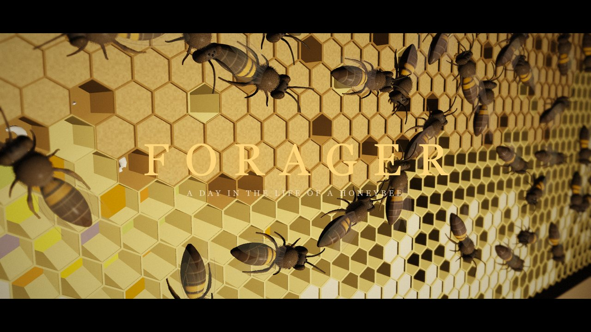

## Three ways to watch

| | |
|---|---|
| **▶ Watch the film** — a ~4½-minute directed story with subtitles: the dark hive, the waggle dance, the first flight, bee vision, shots through her own compound eyes, the flower patch, a crab spider, a bee-eater, home, and her own dance. | 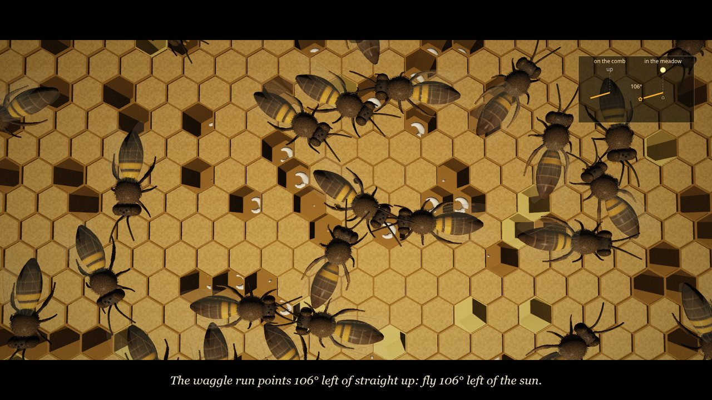 |
| **✿ Fly as a forager** — an open meadow, different every time. Decode the dance, find the patch, fill your crop, avoid predators and fly home along the path-integration vector to dance yourself. | 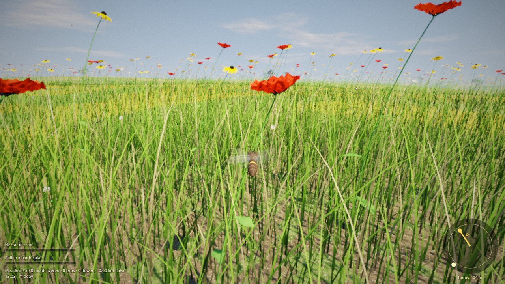 |
| **◉ Through her eyes** — first person through her two compound eyes: thousands of facets and ultraviolet colour. She forages on autopilot while you look around. | 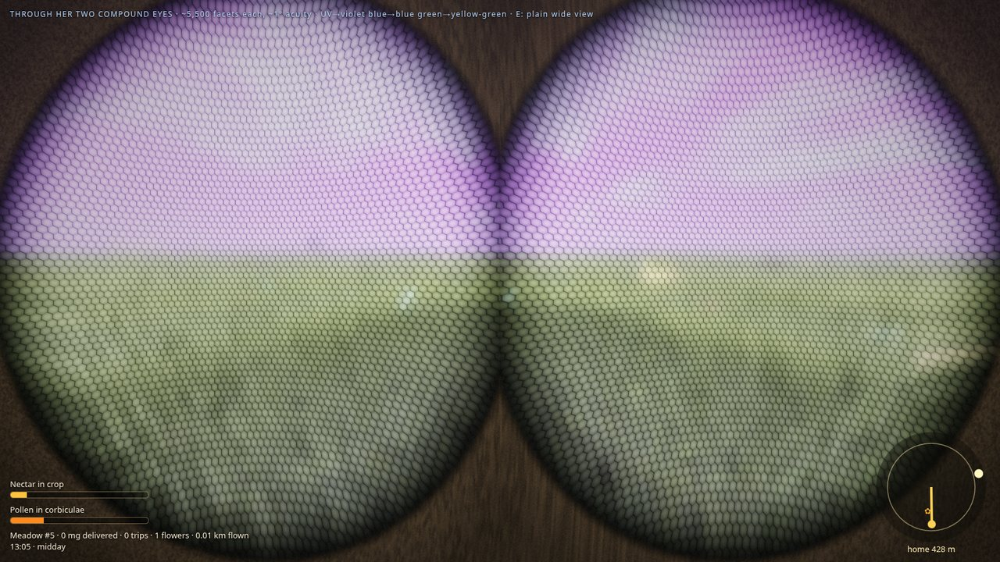 |

## How a bee sees

Every surface is rendered twice in the same pass: once in human RGB and once in the bee's three receptor bands
(UV ≈ 344 nm, blue ≈ 436 nm, green ≈ 544 nm). Every material carries an ultraviolet reflectance, so switching to bee
vision is a live blend, not a filter. False colour: UV → violet, blue → blue, green → yellow-green.

| Human | Bee |
|---|---|
| 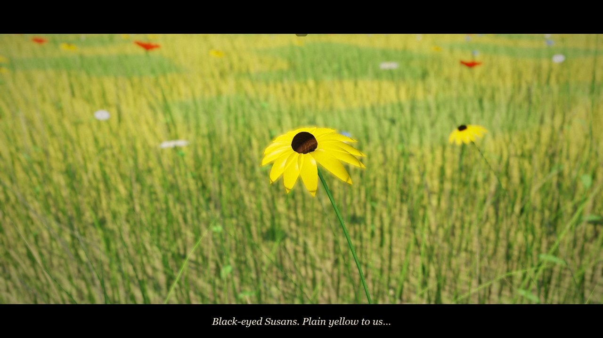 | 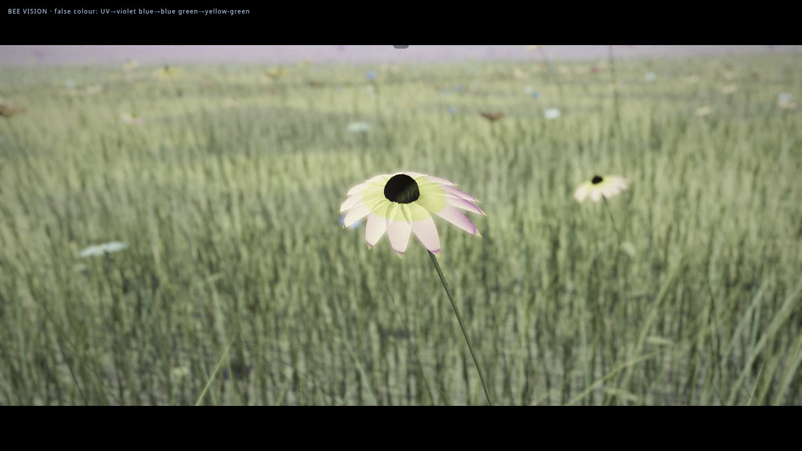 |
| Black-eyed Susans are plain yellow to us… | …to her each one wears a UV bullseye pointing to the nectar. |

- **No red receptor:** red poppies look ultraviolet-violet to her, and they offer only pollen.
- **Polarised sky compass:** the dorsal rim of her eye reads the e-vector pattern around the sun.
- **Optic flow:** she measures distance by how fast the world streams past.
- **Compound eyes:** about 5,500 ommatidia per eye, roughly 1° acuity, and a near-panoramic field of view.

| | |
|---|---|
| 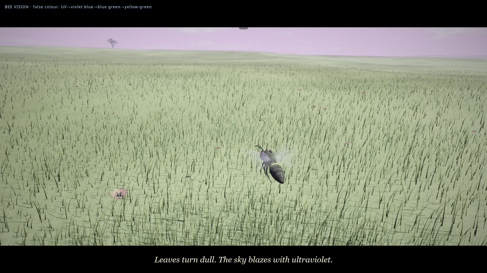 | 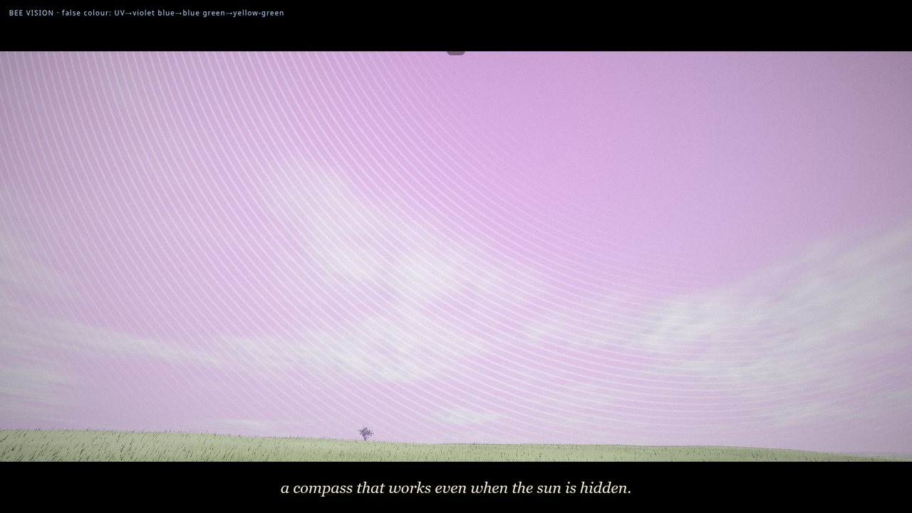 |

## The meadow is alive

| | | |
|---|---|---|
| 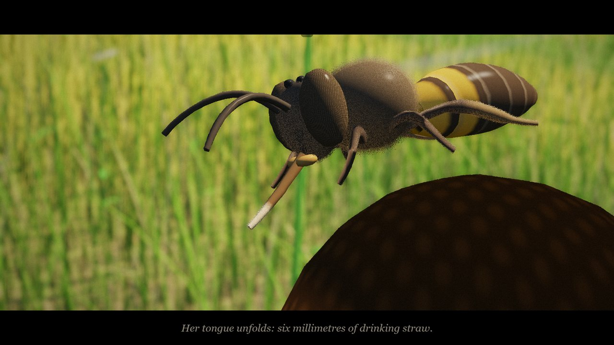 | 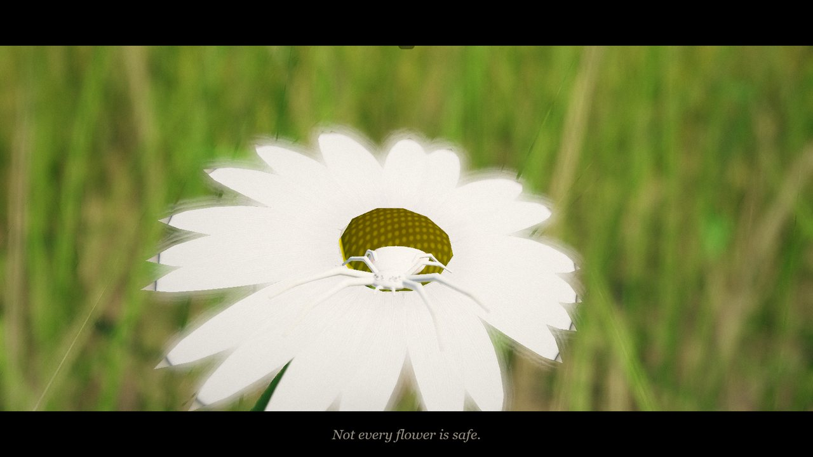 | 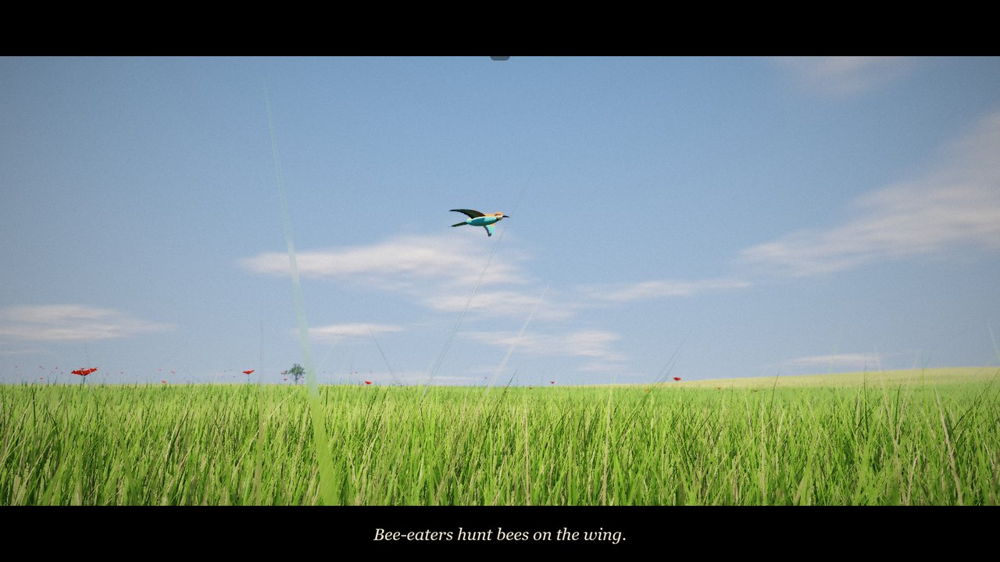 |
| A 6 mm proboscis unfolds and laps; pollen is packed into the corbicula on the hind leg | *Misumena vatia*, a white crab spider waiting on a white daisy | European bee-eaters hunt bees above the grass |
| 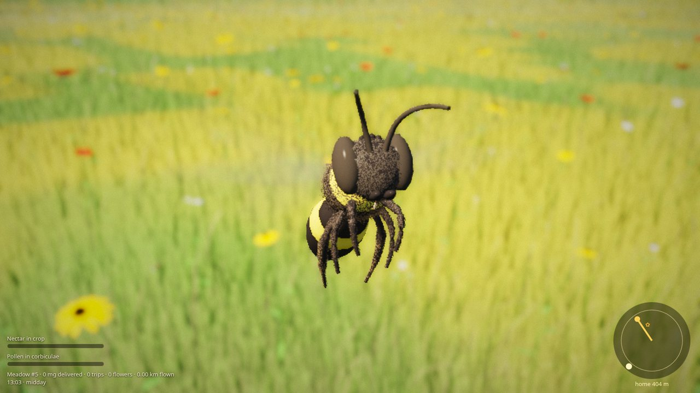 | 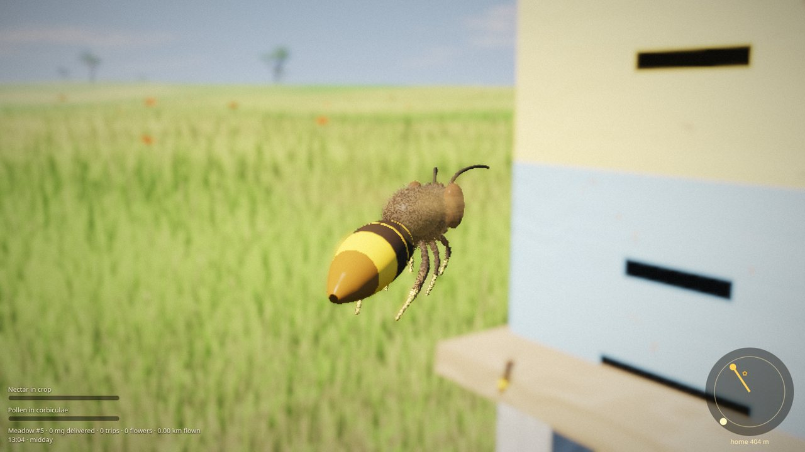 | 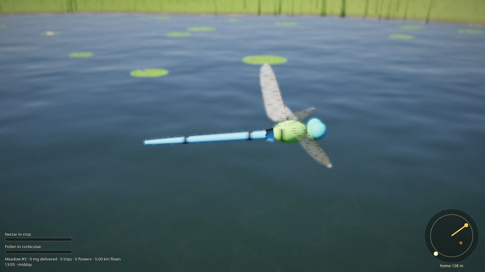 |
| Buff-tailed bumblebees forage alongside her | Yellow-legged hornets hawk at the hive door | Emperor dragonflies patrol the pond |

Also: hundreds of comb workers with real stop-and-go walking and tripod gait, guard bees at the entrance,
marmalade hoverflies, cabbage white and peacock butterflies, European beewolves hunting bees on flowers,
reeds and lily pads, oaks, a painted Langstroth hive, and an interior comb with capped brood, larvae,
eggs, pollen and honey cells.

| | |
|---|---|
| 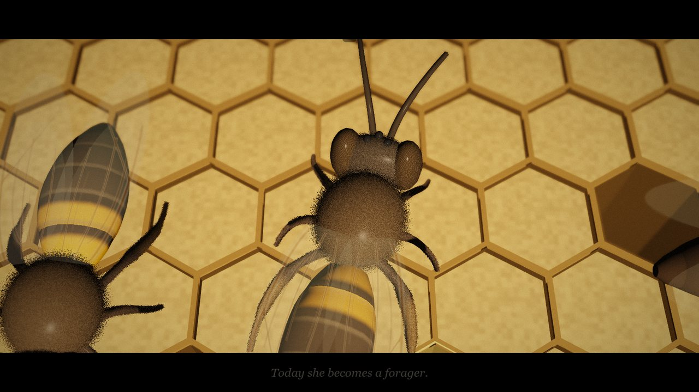 | 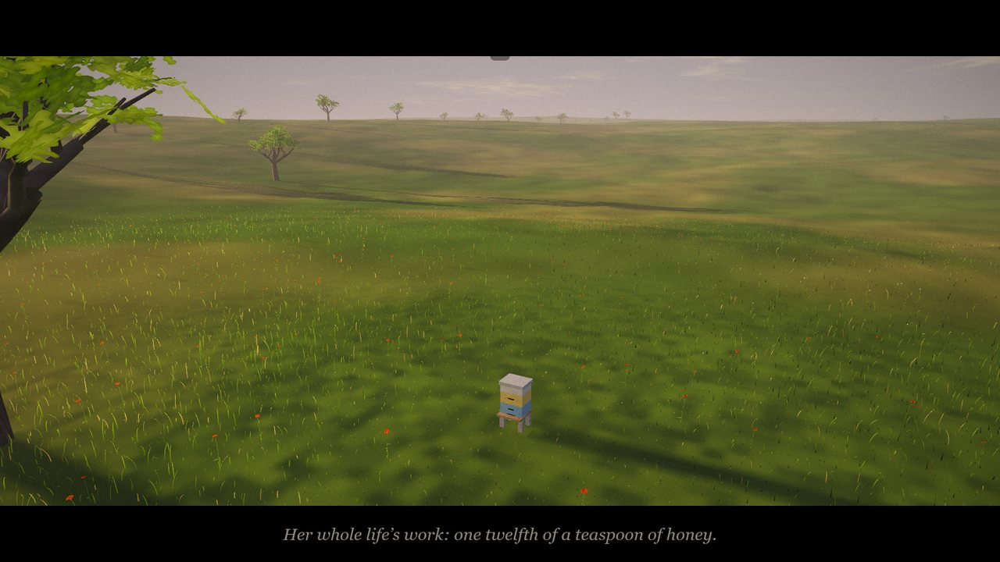 |

## Run it

```bash
./run.sh            # builds (if node is installed) and serves on http://0.0.0.0:9050/
PORT=8080 ./run.sh  # another port
NO_BUILD=1 ./run.sh # serve the committed dist/ as-is (no node needed)
```

Open it in a desktop browser with WebGL2 (Chrome, Edge, Firefox or Safari 17+). It has to be served over
http, because the packed file reads its own bytes. A decent GPU helps, and the render resolution adapts to
keep the frame rate up.

- `dist/index.html` is the packed 49 KiB build.
- `dist/dev.html` is the readable, unminified build for debugging.

### Controls

| Film | Fly / Through her eyes |
|---|---|
| `←` `→` skip shots · `Space` pause · `M` mute · `Esc` menu | mouse or arrows steer · `W` fly · `S` brake · `A` `D` strafe · `Space` up · `Q` down · `Shift` tailwind |
| | `F` land / take off · `V` bee vision · `E` compound eye · `P` polarised sky · `B` her eyes · `T` autopilot · `C` camera |

Fly mode generates a new seeded meadow each time, shown as *Meadow #seed*. Replay one with `?seed=1234`.
The seed changes the terrain, the pond, the oak and hedgerow, the time of day, and the direction, distance
and main flower of the danced patch. The film always uses its own fixed world.

## Biology notes

Claims in the subtitles are kept to well-established figures, hedged where the numbers vary:
- Brood nest at about 35 °C, and colonies of up to ~60,000 workers.
- Foraging starts at about three weeks of age.
- Waggle-run angle from vertical equals the patch's angle from the sun's azimuth, and run duration encodes distance (calibration varies between colonies).
- Cruising speed about 25 km/h, and a proboscis about 6 mm long.
- Crop loads of up to ~40 mg.
- Roughly 800 km flown in a forager's life, and a lifetime's honey of about a twelfth of a teaspoon.
- Poppies are nectarless.
- *Misumena* is UV-cryptic on white daisies.
- Bee-eaters, *Vespa velutina* and *Philanthus* are real honeybee predators that behave as shown.

## How it is built

- **Engine:** raw WebGL2.
  - Rendering: 4× MSAA HDR with multiple render targets (human RGB and bee bands at once), two shadow cascades, depth of field, bloom, ACES tone mapping, a compound-eye mosaic shader, and a sky shader with clouds and polarisation.
  - Terrain and wind: an integer-hash noise that is bit-identical in JS and GLSL, so physics and rendering agree; seeded worlds offset the noise lattice.
  - Instancing: camera-centred grass rings with stochastic level-of-detail fades (~150k blades), CPU-placed flowers shared with the gameplay, fur shells, wing-beat blur fans, and a two-circle crowd solver for the comb.
- **Sound:** WebAudio synthesis only. Wing buzz, hive hum, waggle-run pulses, wind, FM birdsong and bee-eater calls, and an ambient score.
- **Packing:** esbuild minifies the JS and GLSL whitespace is stripped. The raw deflate stream is appended inside a trailing HTML comment, and the page fetches its own bytes and inflates them with `DecompressionStream`. That avoids base64's 33% overhead.

```
src/
  main.js    loop, HUD, input, audio wiring      render.js  passes, shadow maps, post
  glsl.js    every shader                        mesh.js    procedural geometry for every species
  world.js   seeded terrain, flowers, trees      sim.js     agents, gait, comb crowd, light model
  story.js   the film's 18 shots                 play.js    fly mode, enemies, autopilot forager
  life.js    ambient wildlife                    audio.js   synthesiser
test/        headless real-GPU checks (Playwright + ANGLE/Vulkan): shots, gameplay loop, overlaps, pond, worlds
```

```bash
npm install node build.mjs                                   # -> dist/index.html (packed) + dist/dev.htmlnode build.mjs                                   # -> dist/index.html (packed) + dist/dev.html node build.mjs                    # -> dist/index.html (packed) + dist/dev.html
node test/shots.mjs index.html /tmp/out 30 90    # film screenshots at given seconds, fails on page errors
node test/game.mjs index.html                    # land, drink, fly home, dance
node test/overlap.mjs                            # comb bees never interpenetrate
```

---

*Made with [Claude Code](https://claude.com/claude-code).*

## License

MIT — see [LICENSE](LICENSE).
